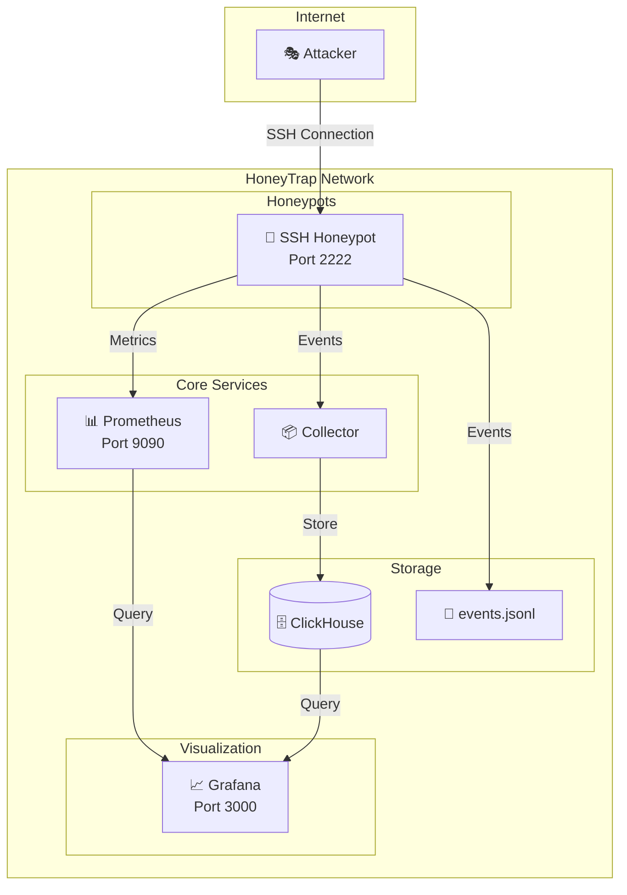
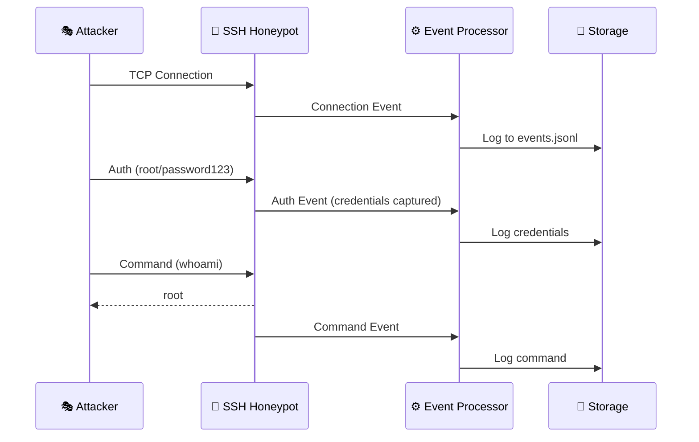
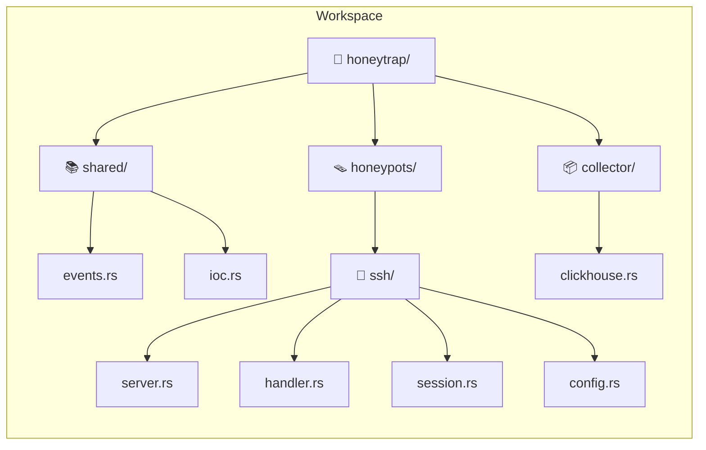
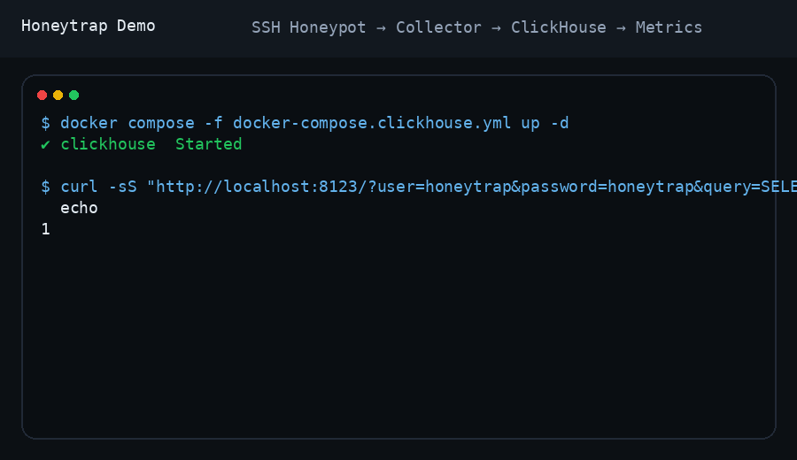
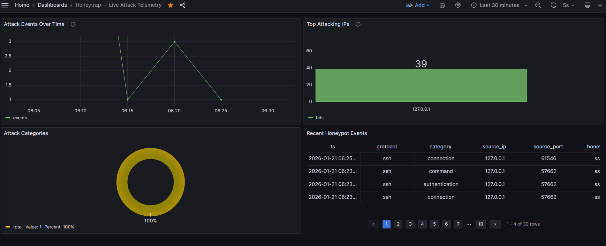
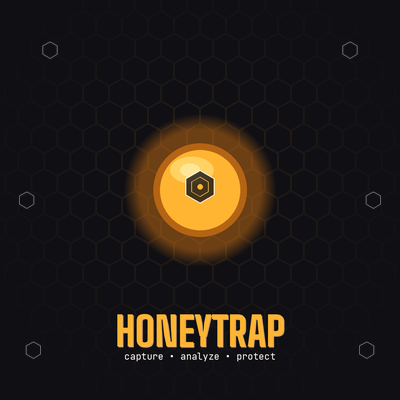

<p align="center">
  
</p>

<p align="center">
  <em>Uncover Threats Faster, Stay One Step Ahead</em>
</p>

<p align="center">
  
  
  
  
</p>

<p align="center">
  <em>Built with the tools and technologies:</em>
</p>

<p align="center">
  
  
  
  
  
  
  
</p>

---


## 📖 Overview

HoneyTrap is a modular honeypot system designed to capture, log, and analyze malicious activity. It simulates vulnerable services to attract attackers and records their every move — from login attempts to shell commands.

---

## 🏗️ Architecture



---

## 🔄 Event Flow



---

## 🛠️ Tech Stack

| Component | Technology | Purpose |
|-----------|------------|---------|
| **Language** |  | Memory-safe, high-performance core |
| **Async Runtime** |  | Handles thousands of concurrent connections |
| **SSH Protocol** | `russh` | SSH server implementation |
| **Serialization** |  | Event formatting and storage |
| **Metrics** |  | Real-time monitoring |
| **Visualization** |  | Dashboards and alerting |
| **Database** |  | High-speed analytics storage |
| **Containerization** |  | Easy deployment |

---

## 📁 Project Structure



```
honeytrap/
├── 📄 Cargo.toml              # Workspace configuration
├── 🐳 docker-compose.yml      # Full stack deployment
├── 📚 shared/                 # Shared library
│   └── src/
│       ├── lib.rs             # Event types, protocols
│       └── ioc.rs             # Indicators of Compromise
├── 🪤 honeypots/
│   └── ssh/                   # SSH Honeypot
│       └── src/
│           ├── main.rs        # Entry point
│           ├── server.rs      # SSH server & event processor
│           ├── handler.rs     # Connection handler
│           ├── session.rs     # Session state management
│           └── config.rs      # Configuration
└── 📦 collector/              # Event collector service
    └── src/
        ├── main.rs
        └── clickhouse.rs      # ClickHouse integration
```

---

## 🚀 Quick Start

### Prerequisites

- **Rust 1.70+** 
  ```bash
  curl --proto '=https' --tlsv1.2 -sSf https://sh.rustup.rs | sh
  ```
- **Docker & Docker Compose** (optional, for full stack)

### Build & Run

```bash
# Clone the repository
git clone https://github.com/lloredia/honeytrap.git
cd honeytrap

# Build release binary
cargo build --release

# Run SSH honeypot
cargo run -p honeytrap-ssh -- --port 2222
```

### Test the Honeypot

```bash
# From another terminal
ssh root@localhost -p 2222
# Enter any password - all credentials are captured!

# Try some commands in the fake shell
whoami
ls -la
cat /etc/passwd
```


## 🚀 Start the Lab using script
```bash
Start ClickHouse and Grafana:


docker compose -f docker-compose.clickhouse.yml up -d
```
## Start the honeypot and collector:
```bash
./run-lab.sh
```
🔐 Connect to Honeypot

```bash
ssh root@localhost -p 2222

```
📊 View Dashboard

Open Grafana in your browser:
```
http://localhost:13000

```
```
### View Captured Events

```bash
cat events.jsonl | jq .
```

---

## Demo

<p align="center">
  
</p>


---

## 📊 Sample Event Output

```json
{
  "id": "d42cbef9-7328-407f-b2f4-0dd9a1cadaf0",
  "session_id": "f97f3ea1-fab7-4c70-964f-902b533457ff",
  "timestamp": "2026-01-21T09:36:42.745Z",
  "protocol": "ssh",
  "category": "authentication",
  "severity": "high",
  "source": {
    "ip": "192.168.1.100",
    "port": 58719
  },
  "destination": {
    "ip": "0.0.0.0",
    "port": 2222,
    "honeypot_id": "ssh-01"
  },
  "credentials": {
    "username": "root",
    "password": "admin123",
    "auth_method": "password",
    "success": true
  },
  "tags": ["password_auth"]
}
```

---

## 🐳 Docker Deployment

### Full Stack

```bash
# Start SSH Honeypot + Prometheus + Grafana
docker-compose up -d
```

| Service | URL | Credentials |
|---------|-----|-------------|
| 🔐 SSH Honeypot | `ssh root@localhost -p 2222` | any password |
| 📊 Prometheus | http://localhost:9090 | - |
| 📈 Grafana | http://localhost:3000 | admin / admin |

### With ClickHouse Analytics

```bash
docker-compose -f docker-compose_clickhouse.yml up -d
```

---

## ⚙️ Configuration

| Environment Variable | Default | Description |
|---------------------|---------|-------------|
| `RUST_LOG` | `info` | Log level (debug, info, warn, error) |
| `SSH_PORT` | `2222` | SSH honeypot listen port |
| `METRICS_PORT` | `9100` | Prometheus metrics port |

### CLI Options

```bash
honeytrap-ssh --help

Options:
  --host <HOST>    Listen address [default: 0.0.0.0]
  --port <PORT>    SSH port [default: 2222]
  -h, --help       Print help
```

---

## 📈 Metrics & Dashboards

Prometheus metrics exposed at `:9100/metrics`:

| Metric | Type | Description |
|--------|------|-------------|
| `honeytrap_events_captured_total` | Counter | Total events by category |
| `honeytrap_active_sessions` | Gauge | Current active sessions |
| `honeytrap_auth_attempts_total` | Counter | Authentication attempts |

### Dashboard Overview



---

## ⚠️ Security Considerations

> **Warning**: Honeypots intentionally attract malicious traffic. Deploy responsibly.

- 🔒 Run in an isolated network/VM
- 🚫 Never expose your real services on the same host
- 📊 Monitor resource usage (attackers may attempt DoS)
- 🔍 Regularly review captured data for actionable intelligence

---

## 🗺️ Roadmap

- [x] 🔐 SSH Honeypot
- [x] 🔑 Credential capture
- [x] 💻 Command logging
- [x] 📊 Prometheus metrics
- [x] 📄 JSON event logging
- [ ] 🌐 HTTP/HTTPS Honeypot
- [ ] 📡 Telnet Honeypot
- [ ] 📂 FTP Honeypot
- [ ] 🌍 GeoIP enrichment
- [ ] 🚨 Real-time alerting
- [ ] 🖥️ Web UI dashboard

---

## 🤝 Contributing

Contributions are welcome! Please feel free to submit a Pull Request.

1. Fork the repository
2. Create your feature branch (`git checkout -b feature/amazing-feature`)
3. Commit your changes (`git commit -m 'Add amazing feature'`)
4. Push to the branch (`git push origin feature/amazing-feature`)
5. Open a Pull Request

---

## 📄 License

This project is licensed under the MIT License - see the [LICENSE](LICENSE) file for details.

---

## 🙏 Acknowledgments

- [russh](https://github.com/warp-tech/russh) - Rust SSH implementation
- [Tokio](https://tokio.rs/) - Async runtime for Rust
- [Cowrie](https://github.com/cowrie/cowrie) - Inspiration for SSH honeypot features

---

<p align="center">
  
  <br>
  <strong>Made by <a href="https://github.com/lloredia">lloredia</a></strong>
</p>
